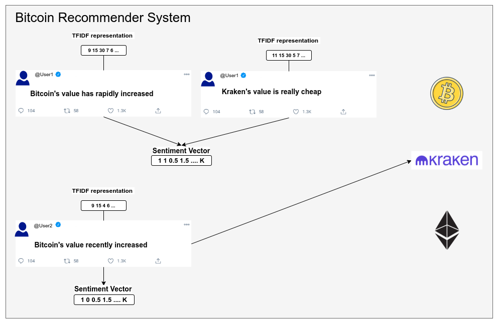

[](https://opensource.org/licenses/MIT)
## Cryptocurrency Recommendation based on Tweets
<p align="center">
 <br /> <br />
</p>

:zap:Note: this assignment is based on two previous projects. Refer to them at first: 
1. [nearest-neighbor-search](https://github.com/PetropoulakisPanagiotis/nearest-neighbor-search)
2. [clustering](https://github.com/PetropoulakisPanagiotis/clustering)

# Explanation 
Cryptocurrency Recommendation(User Based k-Nearest Neighbors). Every user has written some posts and he is represented by a sentiment vector. These posts are represented with two ways: tokenized form and vector form(Tfid). <br /> 
There are 4 available methods: <br />
* Recommendation via k-nearest neighbors with lsh[1]
* Recommendation via k-nearest pseudo neighbors with lsh[2]
* Recommendation via k-nearest neighbors with clustering[3]
* Recommendation via k-nearest pseudo neighbors with clustering[4]
<br />
Note: There are also pseudo users. Pseudo users have been created with clustering. This clustering is performed in vector posts of users. After that every pseudo user owns the corresponding token posts of his cluster. Finaly these peusdo users have their own sentiment.

## [1] Method: Lhs - Users
For every user find with [lsh](https://github.com/PetropoulakisPanagiotis/neighbors-problem) method his k-nearest neighbors and recommend unknown coins.

## [2] Method Lsh - Pseudo Users
Same with method 1 but the k-nearest neighbors for every user are Pseudo Users from the initial clustering.

## [3] Method - Clustering - Users
First of all, clustering is performed. After that k-nearest neighbors for every user are the users that reside in the same cluster with the user's cluster.

## [4] Method - Clustering - Pseudo Users
Clustering is performed for pseudo users. In the next step for every user we find the nearest cluster and then the k-nearest neighbors of this user reside in the nearest cluster. 

## Installation
Clone this repository to your local machine: 
```
git clone https://github.com/PetropoulakisPanagiotis/cryptocurrencyRecommendation.git
```

## Replicate the results 
```
$ make
$ make run
```

## Author
Petropoulakis Panagiotis petropoulakispanagiotis@gmail.com
